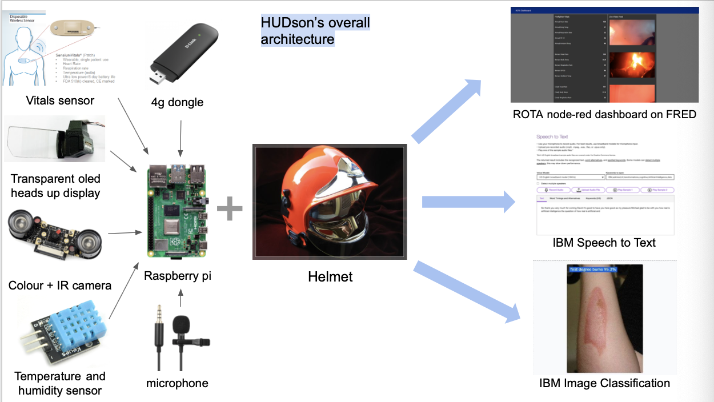
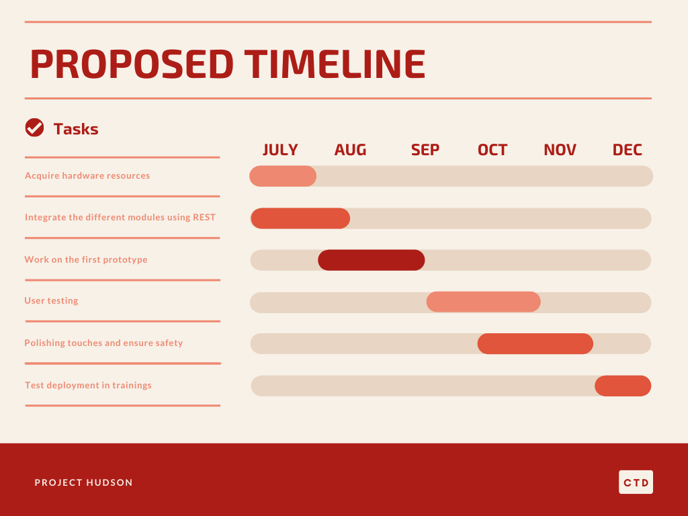

## Team CTD

Team C T D aspires to connect the dots and move mountains :sparkles: :sparkles: :sparkles:

* Sajjad Ali Qadri
* Muhammad Hazzry Bin Shafaruan
* Azizi Azfar Bin Zahari

## Problems Identified
1. Often times when someone realises that he is experiencing heat stroke, it is already too late.
2. Necessary on-the-ground information for the ROTA Commander to make informed decisions
3. Lag-time between accessing injuries and treating injuries

## About HUDson
Our idea aims at tackling these issues by taking advantage of the availability of IOT sensors and IBM's Cloud Services.

The HUDson is an enhancement to the current bunker gear by integrating a wearable system within it. Sensors that measure the user's vitals such as Temperature (both Ambient and User), Heart Rate, SP02 allows for the commanders to keep track of the user's condition during training and operations. 

It also consists of a HUD (Heads Up Display) to provide real-time feeds from these sensors to the user. The system is also connected to the cellular network to provide direct communications between the responders.

## Pitch Video
Do click below to watch our video, thank you!
[](https://youtu.be/EKC40VrvaJc)

## Project Architecture


## Detailed Solution
The details to our proposed solution can be found [here](https://docs.google.com/document/d/1du0OzhGNdTIKyl838Xxb77k3qJ4IGJGB11jquXxrRsU/edit?usp=sharing).

## Proposed Timeline


## Getting Started

Follow the instructions below to setup the project on your local machine:

### Node-Red
----------------------------

1. Install node red for the machine you’re using using this website: https://nodered.org/docs/getting-started/
2. Open command prompt/terminal and type the following commands 
```
npm install node-red-contrib-ui-media
npm install node-red-dashboard
```
3. Then type node-red into terminal and navigate to localhost:1880 on web browser to go to node-red editor
4. Click on 3 horizontal bars at top right hand corner to bring up context menu
5. Click on import 
6. Navigate to “node-red items” folder from cloned github repository
7. Open node-red flow.txt file, select all and copy to the import panel in node-red editor, then click import flows
8. Inside the node-red items folder, right click the “firefighter_ahamad_json.txt”, go to properties and get the full path of the file
9. Double click firefighter_ahamad_json.txt node (usually in brown) and paste the path of the file
10. Repeat with all other firefighter nodes
11. Click on clip1 node (in blue), click Files tab, click the book looking thing, click `Add new…`, click `Choose Files`, navigate to `node-red items` folder from cloned github repository and select `clip_1`, click on the upload button next to the x button to upload  
12. Repeat **step 11** with `clip2 - clip4`  nodes  
13. Click Deploy button on top right and go to `localhost:1880/ui` to see a rough preview of the UI that the ROTA commanders will see


### Cloud Annotations
----------------------------

#### Setup
1. `git clone` the repo and `cd` into it by running the following command:

```bash
git clone https://github.com/cloud-annotations/classification-react.git
cd classification-react
```

2. Download the necessary dependencies for the project with the following command:
`npm install`

> Note: You’ll need to have Node 8.10.0 or later on your local development machine. You can use [nvm](https://github.com/creationix/nvm#installation) (macOS/Linux) or [nvm-windows](https://github.com/coreybutler/nvm-windows#node-version-manager-nvm-for-windows) to easily switch Node versions between different projects.

3. Add **TensorFlow.js Model** to the App by copying the `model_web` directory generated from the classification walkthrough and paste it into the `public` folder of this repo.

4. Run the App using the following command:
`npm start`

>Open [http://localhost:3000](https://docs.google.com/document/d/1du0OzhGNdTIKyl838Xxb77k3qJ4IGJGB11jquXxrRsU/edit?usp=sharing) to view it in the browser.

### IBM Speech-To-Text
----------------------------
#### Setting Up IBM Cloud
1. Sign up for an IBM Cloud account.
2. Download the IBM Cloud CLI.
3. Create an instance of the Speech to Text service and get your credentials:
    * Go to the Speech to Text page in the IBM Cloud Catalog.
    * Log in to your IBM Cloud account.
    * Click **Create**.
    * Click **Show** to view the service credentials.
    * Copy the `apikey` value.
    * Copy the `url` value.
  
#### Setting Up on Local Machine
1. In the application folder, create a file called .env

`touch .env`

2. Open the .env file and add the service credentials that you obtained during the setting up of IBM Cloud.

```
SPEECH_TO_TEXT_IAM_APIKEY={ apikey } 
SPEECH_TO_TEXT_URL={ url }
```

**Example** .env file that configures the apikey and url for a Speech to Text service instance hosted in the US East region:

```
SPEECH_TO_TEXT_IAM_APIKEY=X4rbi8vwZmKpXfowaS3GAsA7vdy17Qh7km5D6EzKLHL2
SPEECH_TO_TEXT_URL=https://gateway-wdc.watsonplatform.net/speech-to-text/api
```
#### Running on Local Machine
1. Install the necessary dpendencies
`npm install`

2. Run application
`npm start`

3. View the application in a browser at `localhost:3000`

## Libraries and Services Used
----------------------------
* IBM Cloud Annotations for Object Classification
* IBM Speech-To-Text
* IBM Watson Assistant
* IBM Cloud for Node-Red Deployment 
* Node-Red
* ReactJS
_____________________
**Powered by IBM**